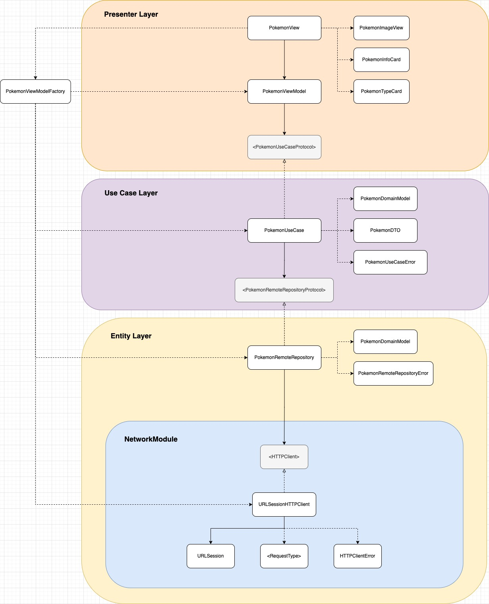

# PokeAPI-interview-test

### Overview
This project implements a Pokemon detail view using SwiftUI and Combine, fetching data from the PokeAPI. The implementation follows Clean Architecture principles with MVVM pattern, separating concerns into Presentation, Use Case, and Entity layers.

### Requirements

- iOS 15.0+

### Setup Instructions

1. Clone the repository
2. Open `PokeAPI-interview-test.xcodeproj` in Xcode
3. Build and run the project

### Architecture
The project is structured using Clean Architecture with the following layers:

#### High Level Diagram
[High level diagram](https://drive.google.com/drive/folders/15rIacsO6dAGqoUKn4hbONUlW1gptQaCV?usp=sharing)

#### Layer Details

**Presenter Layer**

- `PokemonView`: Main Pokemon view
- `PokemonImageView`: Handles Pokemon image display
- `PokemonInfoCard`: Displays Pokemon information
- `PokemonTypeCard`: Shows Pokemon type information
- `PokemonViewModel`: Manages view state and business logic
- `PokemonViewModelFactory`: Factory for creating view models

**Use Case Layer**

- `PokemonUseCaseProtocol`: Defines contract for Pokemon data operations
- `PokemonUseCase`: Contains business logic for fetching Pokemon data
- `PokemonDomainModel`: Domain model for Pokemon data
- `PokemonDTO`: Data transfer object for mapping API responses
- `PokemonUseCaseError`: Custom error type for use case operations

**Entity Layer**

- `PokemonRemoteRepositoryProtocol`: Defines contract for remote data operations
- `PokemonRemoteRepository`: Handles API communication
- `PokemonDomainModel`: Domain model for Pokemon data
- `PokemonRemoteRepositoryError`: Custom error type for repository operations

**Network Module**

- `HTTPClient`: Defines contract for network operations
- `URLSessionHTTPClient`: Network client implementation
- `RequestType`: API request definitions
- `HTTPClientError`: Network error handling

### Key Features

- SwiftUI implementation with Combine framework
- Clean Architecture with MVVM pattern
- Utilize dependency inversion with protocol
- Factory pattern for dependency injection
- Custom error types for each layer
- End to end tests for NetworkModule

### Author
Judy Tsai